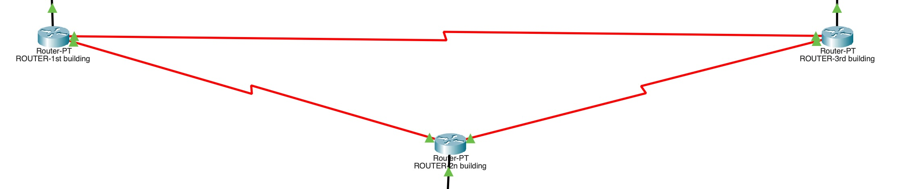

# Company Business Network

This project represents a simulated corporate network in Cisco Packet Tracer, structured to connect multiple buildings with wired and wireless infrastructure. The network is designed to provide efficient communication, traffic segmentation, and enterprise security.

## Network Architecture
The network consists of three main interconnected buildings:

The three main routers are connected to each other via serial ports.

####  1. First Building (192.168.1.0)

- Main switch for traffic distribution.
- Server configured with **DHCP** (Dynamic Host COnfiguration Protocol) service.
- Laptops and computers for employees.
- Network printer.
- Access Point with **SSID** configuration.

#### 2. Second Building (192.168.2.0)

- The location is divided into two floors with a **VLAN**(Virtual Local Area Network) for each floor, using 3 switches.
- Server configured with **DHCP** (Dynamic Host COnfiguration Protocol) service.
- Network printers for the various floors.
- Workstations for employees.
- Access Point with **SSID** configuration.

#### 3. Third Building (192.168.3.0)

- Distribution switch to manage the main connections.
- Server configured with **DHCP** (Dynamic Host COnfiguration Protocol) service.

**The network is designed to be scalable and adaptable to new business needs.**