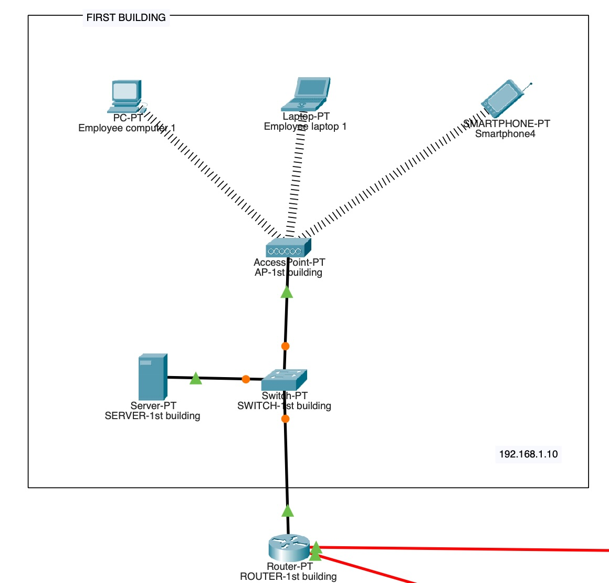
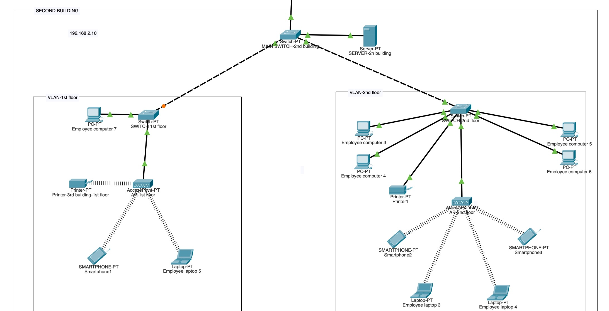
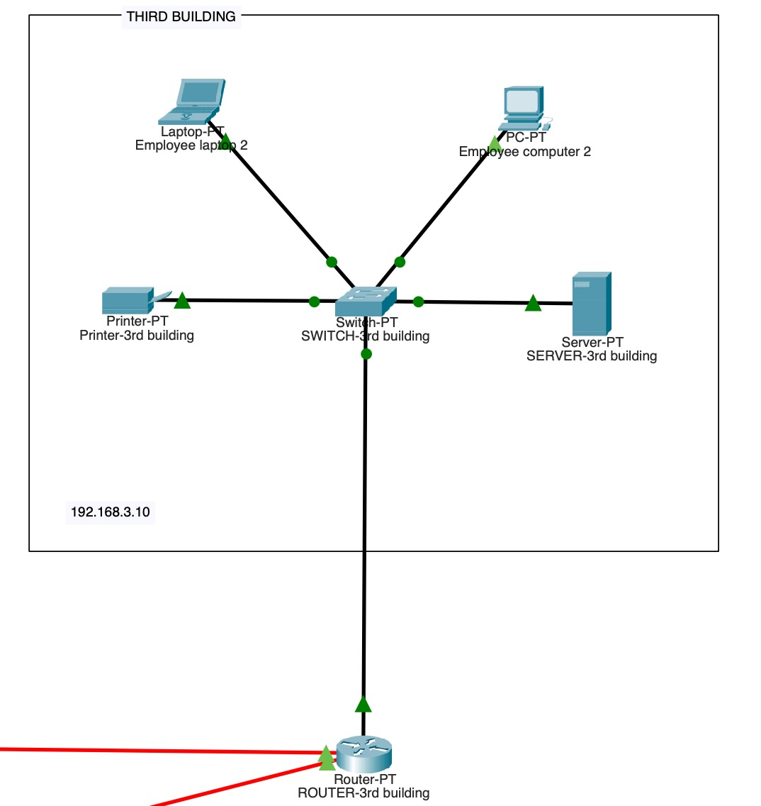

# Company Business Network

This project represents a simulated corporate network in Cisco Packet Tracer, structured to connect multiple buildings with wired and wireless infrastructure. The network is designed to provide efficient communication, traffic segmentation, and enterprise security.

I tre router centrali sono connessi tra di loro tramite porte seriali
Server confugurato con il servizio DHCP(Dynamic Host COnfiguration Protocol)
Access Point con SSID configurato
La sede è divisa in due piani con una VLAN(Virtual Local Area Network) per ogni piano

## Network Architecture
The network consists of three main interconnected buildings:

####  1. First Building (192.168.1.0)

Dedicated router for communication management
Main switch for traffic distribution
Local server for business services
Laptops and computers for employees
Network printer
Access Point for wireless connection

#### 2. Second Building (192.168.2.0)

Dedicated router connected to the network core
Main switch for network management
Internal server for business applications
Network printers for the various floors
Workstations for employees
Access Point for wireless connection

#### 3. Third Building (192.168.3.0)

Main router for routing between buildings
Distribution switch to manage the main connections
Central server for business services
Redundant connections between routers to ensure reliability

The network is designed to be scalable and adaptable to new business needs.